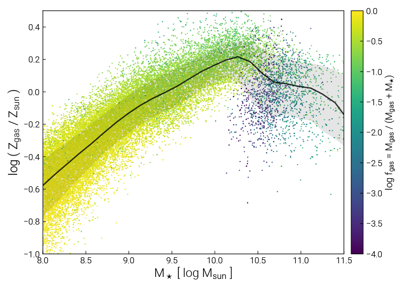
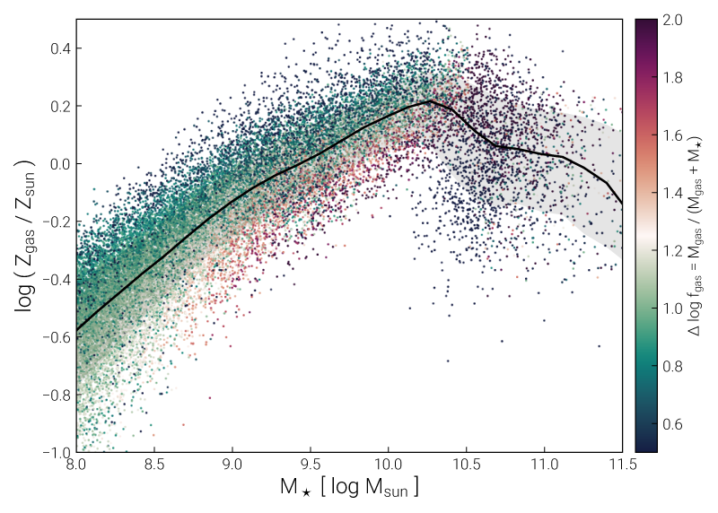
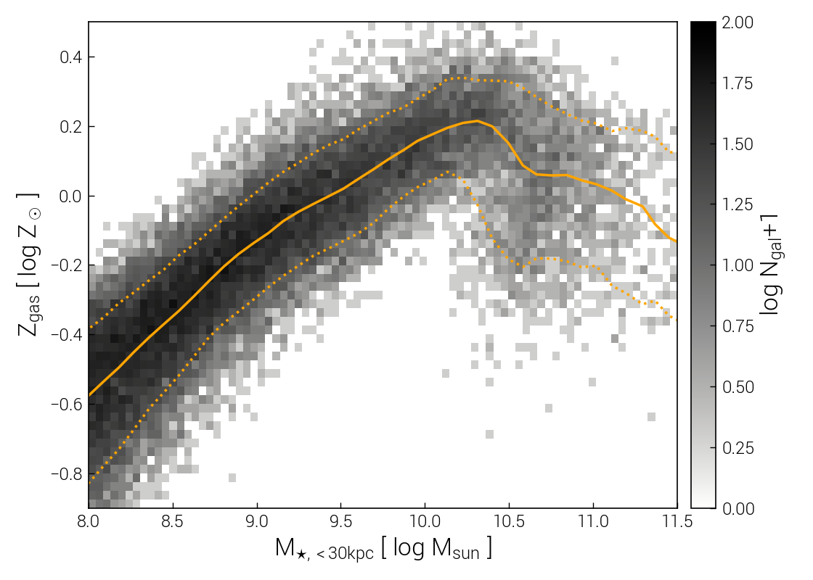
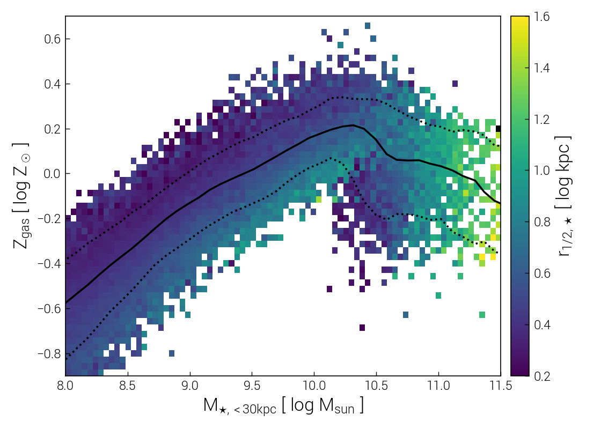
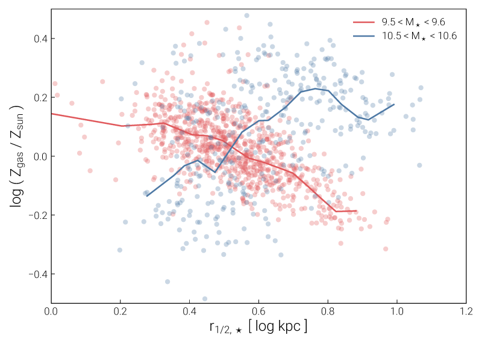
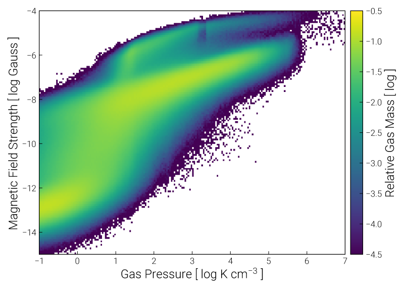
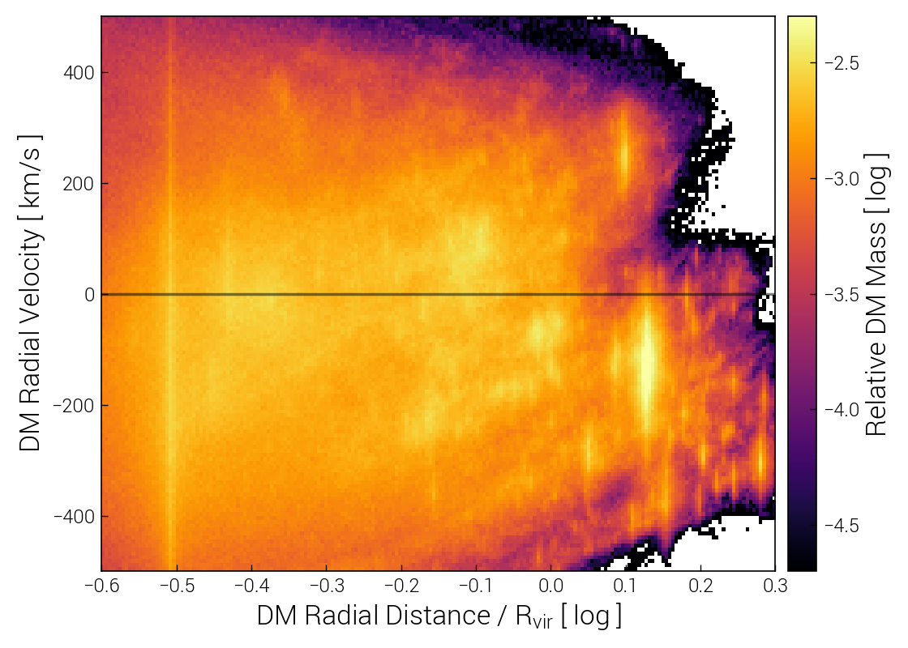

Plotting
========

There are two general types of plots which are broadly useful for exploration:

* those based on (group) catalog values, i.e. for relations in the halo/galaxy population
* those based on (particle/cell) snapshot values, i.e. for relations between gas/stellar/DM properties

While custom-derived quantities can be used within these plot types, it is also expected that users 
may need to create their own custom plotting routines, if the functionality below is not sufficient.

Exploratory Plots for Galaxies (Catalog Values)
-----------------------------------------------

We continue from the :doc:`first_steps` here. The plotting functions in 
:py:mod:`plot.subhalos <temet.plot.subhalos>` can be useful for exploring trends in the 
objects of the group catalogs, i.e. galaxies (subhalos).

Let's examine a classic observed galaxy scaling relation: the correlation between gas-phase metallicity, 
and stellar mass, the "mass-metallicity relation" (MZR).

.. code-block:: python

    sim = temet.sim(run='tng100-1', redshift=0.0)

    temet.plot.subhalos.median(sim, 'Z_gas', 'mstar_30pkpc')

This produces a PDF figure named ``medianQuants_TNG100-1_Z_gas_mstar_30pkpc_cen.pdf`` in the current working 
directory. It shows the mass-metallicity relation of TNG100 galaxies at :math:`z=0`, and looks like this:

.. image:: _static/first_steps_medianQuants_1.png

We can enrich the plot in a number of ways, both by tweaking minor aesthetic options, and by including 
additional information from the simulation. For example, we will shift the x-axis bounds, and also 
include individual subhalos as colored points, coloring based on gas fraction::

    sim = temet.sim(run='tng100-1', redshift=0.0)

    temet.plot.subhalos.median(sim, 'Z_gas', 'mstar_30pkpc', 
      xlim=[8.0, 11.5], scatterColor='fgas2')

This produces the following figure, which highlights how lower mass galaxies have high gas fractions of 
nearly unity, i.e. :math:`M_{\rm gas} \gg M_\star`, and that gas fraction slowly decreasing with stellar 
mass until :math:`M_\star \sim 10^{10.5} M_\odot`. At this point, the overall gas metallicity turns over 
and starts to decrease, as indicated by the black median line. Gas fractions also drop rapidly, reaching 
:math:`f_{\rm gas} \sim 10^{-4}` before starting to slowly rise again. This feature marks the onset of 
galaxy quenching due to supermassive black hole feedback.

To more clearly see, and better understand, subtle secondary correlations, we can change the coloring. 
Instead of using color to represent the actual gas fraction values, we can instead represent the 
**relative** gas fractions, with respect to their median value at each stellar mass::

    sim = temet.sim(run='tng100-1', redshift=0.0)

    temet.plot.subhalos.median(sim, 'Z_gas', 'mstar_30pkpc', 
      xlim=[8.0, 11.5], scatterColor='fgas2', cRel=[0.5,2.0,False])

More generally, the color quantity is made relative to its running median value as a function of the 
x-axis value (indicated in the colorbar label with the prefix :math:`\Delta`). The ``cRel`` 3-tuple 
controls the behavior. The first two values give the lower and upper limits of the relative color scale, 
while the third entry specifies whether we should log the values. For instance, you could also try 
``cRel=[-0.3,0.3,True]`` to obtain a similar plot. The resulting figure:

The figure clearly reveals that intermediate mass galaxies, e.g. with 
:math:`10^8 < M_\star / \rm{M}_\odot < 10^9`, have lower gas fractions if they have higher gas 
metallicities, and vice versa, at **fixed** stellar mass. This is the 
`fundamental metallicity relation <https://arxiv.org/abs/1005.0006>`_.

Instead of plotting individual colored markers, which can be misleading due to overcrowding and overlap, 
we can also use the technique of two-dimensional histograms, where the color can either indicate the 
number of objects in each pixel::

    sim = temet.sim(run='tng100-1', redshift=0.0)

    temet.plot.subhalos.histogram2d(sim, 'Z_gas', 'mstar_30pkpc', xlim=[8.0, 11.5])

.. note:: This is the same plot made by the following API endpoint of the TNG public data release:
    https://www.tng-project.org/api/TNG100-1/snapshots/99/subhalos/plot.png?xQuant=mstar2&yQuant=Z_gas
    and this API request is handled using the same plotting function we just called.

Alternatively, the color can indicate the median value of a third property for all the objects in each pixel::

    sim = temet.sim(run='tng100-1', redshift=0.0)

    temet.plot.subhalos.histogram2d(sim, 'Z_gas', 'mstar_30pkpc', cQuant='size_stars', xlim=[8.0, 11.5])

Finally, we can provide a more quantitative look at secondary correlations with a vertical 'slice'. 
For example, given the plot above, we can look at the correlation between gas metallicity and stellar size 
(half mass radius) for galaxies in particular, narrow stellar mass bins, contrasting 
:math:`10^{9.5} < M_\star / \rm{M}_\odot < 10^{9.6}` against :math:`10^{10.5} < M_\star / \rm{M}_\odot < 10^{10.6}`::

    sim = temet.sim(run='tng100-1', redshift=0.0)

    temet.plot.subhalos.slice([sim], xQuant='size_stars', yQuants=['Z_gas'], sQuant='mstar_30pkpc_log',
      sRange=[[9.5, 9.6],[10.5, 10.6]], ylim=[-0.5, 0.5], xlim=[0.0, 1.2])

This confirms the visual impression above, that the direction of the correlation between size and metallicity 
is different at these two mass scales. Note that automatic limits will be chosen for quantities, but these 
can be overriden by e.g. the ``xlim`` and ``ylim`` arguments when needed.

These methods are the bread and butter of exploring trends. Once you add a custom calculation for a new 
property of subhalos, i.e. compute a value which isn't available by default, you can understand how it varies 
across the galaxy population, and correlates with other galaxy properties, with these same methods.

Exploratory Plots for Snapshots (Particle/Cell Values)
------------------------------------------------------

Here we also continue from the corresponding section of the :doc:`first_steps`.

Similar to above, :py:mod:`plot.snapshot <temet.plot.snapshot>` provides general plotting routines focused 
on snapshots, i.e. particle-level data. These are also then suitable for non-cosmological simulations.

For example, we could plot the traditional 2D "phase diagram" of density versus temperature. However, we can 
also use any (known) quantity on either axis. Furthermore, while color can represent the distribution of 
mass, it can also be used to show the value of a third particle/cell property, in each pixel. Let's look at 
the relationship between gas pressure and magnetic field strength at :math:`z=0`::

    sim = temet.sim(run='tng100-1', redshift=0.0)

    temet.plot.snapshot.phaseSpace2d(sim, 'gas', xQuant='pres', yQuant='bmag')

For cosmological simulations, we can also look at particle/cell properties for one or more (stacked) halos. 
For example, the relationship between (halocentric) radial velocity and (halocentric) distance, for all dark 
matter particles within the tenth most massive halo of TNG50-1 at :math:`z=2`::

    sim = temet.sim(run='tng50-1', redshift=2.0)
    haloIDs = [9]

    opts = {'xlim':[-0.6,0.3], 'ylim':[-800,600], 'clim':[-4.7,-2.3], 'ctName':'inferno'}
    temet.plot.snapshot.phaseSpace2d(sim, 'dm', xQuant='rad_rvir', yQuant='vrad', haloIDs=haloIDs, **opts)

Here we see individual gravitationally bound substructures (subhalos) within the halo as bright vertical 
features.

As with the group catalog plotting routines above, color can represent either the distribution of mass in 
this plane, or it can be used to visualize the value of a third particle/cell property, in each pixel. TODO.

In the case of a cosmological simulation with group catalogs, any of these plots can be restricted to one or 
more [sub]halos, for instance to create stacks in different bins of galaxy properties such as mass.

1D histograms.

1D and 2D radial profiles, with respect to a given position, typically the center of a halo.
